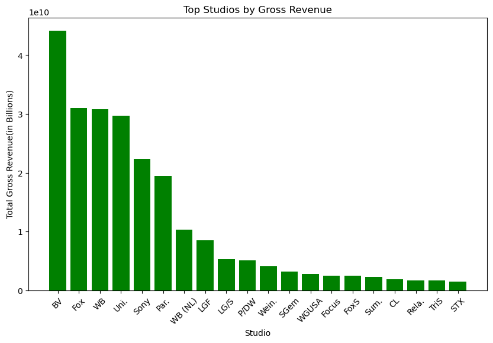

## MICROSOFT CORPORATION RESEARCH INTO THE MOVIE PRODUCTION INDUSTRY.

#### Introduction
The movie industry has been on an upward trend in the last few years due to the fact that online streaming services have made them more available to the consumer at the convenience of their own homes or in the palm of their own hands. There is a boom and the new gold rush is new and original content.

#### Executive Summary
Microsoft Corporation, a powerhouse of technology, specializes in development and support of a number of functions in the modern day. It offers convenience and safety for all businesses and individuals who use their products. 

#### Domain of the Business
The key areas that Microsoft Corporation focuses on are personal computing, intelligent cloud and productivity and business processes. These are the backbone of most business operations and personal interests. For many years, it has dominated the Operating Systems portion of the market and later joined into cloud  storage and a few other nifty tools for businesses to manage various aspects of their operations and a social network cite for professionals. On the individual level it has been in homes being an  education tool through Windows and entertainment through an aray of devices and gaming related products and services.

In recent years, due to an increase in streaming apps and a consumer base hungry for  original content, the movie industry has seen a boom likened to the boom during the Golden Age of Hollywood. When the advancement, like we are currently going through, made movies more appealing and accessible to the consumer back then.. After the introduction of the Television made movies more accessible to the everyday “Joe” it stoked  the fire of our imagination of all the endless possibilities of stories the human experience can conjure up.

#### Business Case
Microsoft Corporation has recently shown interest in the movie production industry. The companies worldwide reach and brand recognition has put it square in the path to challenge the current norm in  production business. The companies can-do attitude when it comes to its pioneering research and user friendly products combined with a market ready for new and exciting movie experiences will shake up the market and put it as a leading production house.

Microsoft should consider starting a production company to diversify their portfolio, leverage  its existing technology and entertainment assets, and capitalize on the growing demand for streaming content . This business case will outline rationale, objectives, financial projections, and potential risks associated with this venture.

#### Business Understanding
The global film industry was estimated to be USD 94.451 billion in 2022 and expected to reach $169.62 billion by 2030  with a compound annual growth rate (CAGR) of approximately 7.21% .
The driving force behind this groth is due in part to increase of consumption of media and entertainment products across different platforms and in-part fueled also by the increasing efforts of the production houses to improve movies or any other entertainment program-watching experience through their increased investment in creating visually stu ning and immersive content.

#### Problem Statement
Limited diversification : Currently Microsoft vulnerable to market fluctuations as it is highly reliant on software, hardware and cloud services.
Content control: control over its original content will give Microsoft an edge.
Market growth: Movies and entertainment streaming platforms are on the rise presenting a significant opportunity.
Competition: The main competitors in the North American market are;-Universal Pictures, Paramount Pictures, Warner Bros., Walt Disney Studios, and Sony Pictures. Due to their market share North America holds 34.55% of the global movie market share. 

##### Objective
The objectives for this research is :-
To look at consumer trends
To look at production trends
To look at revenue trends in the regional and global arena.

#### Data Analysis

This shows the top studios by revenue.

This shows Domestic versus foreign gross.

This shows the top genre

This shows movies by highest average rating

#### Recommendation.
Investing in the movie industry involves making informed decisions. Given the dynamic nature of the movie industry, it's advisable to diversify your investments across genres, domestic and foreign market. This reduces risk by spreading investments across a range of opportunities.
Review the "Top Studios by Gross Revenue” and  consider leveraging Microsoft’s advancement in technology to bring the studio to industry standards. Investing in genres that align with consumer preferences, as indicated by the "Movies by Highest Average Ratings" graph. A strong international presence may offer greater growth opportunities while continuously monitor consumer trends and production trends in the industry.
 Be adaptable and ready to adjust your investment strategy based on evolving audience preferences while nderstand the competitive landscape among studios is important. Partnership with studios that demonstrate the ability to compete effectively, especially in the global market might be important while stile in the learning curv stage.
Acknowledge the inherent risks in the movie industry, including unpredictable box office performance and changing consumer behavior. Diversifying your investments to mitigate these risks.Movie investments often yield returns over an extended period and avoid making impulsive decisions based on short-term fluctuations.Consult with industry experts who specialize in entertainment investments. They can provide valuable insights and help you make informed decisions.
 The movie industry is influenced by factors such as technological advancements and cultural shifts.Remember that investing in the movie industry carries inherent risks, and no investment is guaranteed to succeed. It's essential to balance potential returns with risk tolerance and investment goals. By following these recommendations and staying informed, Microsoft Corporation can position themselves for success in the dynamic world of filmmaking.

